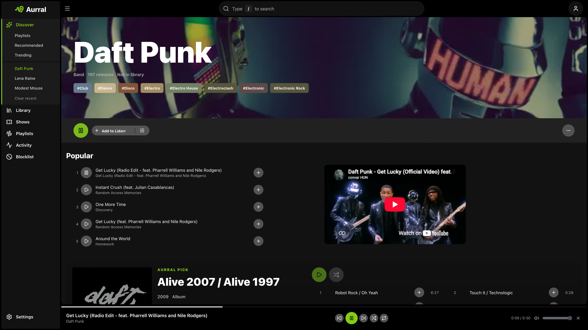
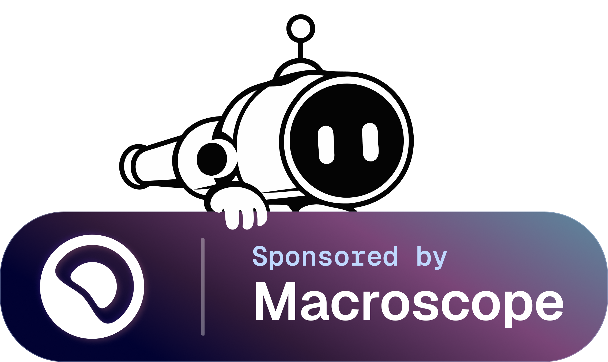

<div align="center" width="100%">
  <picture>
    <source media="(prefers-color-scheme: dark)" srcset="docs/src/assets/readme.svg" />
    
  </picture>
</div>

[](https://ghcr.io/lklynet/aurral)
[](https://github.com/lklynet/aurral/pkgs/container/aurral)


[](https://github.com/lklynet/aurral/actions/workflows/ci.yml)

[](https://github.com/sponsors/lklynet/)

Aurral is self-hosted music discovery with its own music library. Best-in-class recommendations, rotating flows, playlist downloads, and a library that Aurral manages, with Lidarr as an optional add-on.

## Quick links

- [Website](https://aurral.org)
- [Documentation](https://docs.aurral.org/)
- [Discord](https://discord.gg/cpPYfgVURJ)

## Features

- **Discover**: Personal recommendations, trends, tags, recent and upcoming releases, discover playlists, artist news, and nearby shows.
- **Search**: Find artists and albums, preview tracks, and add them to Aurral or Lidarr with your defaults.
- **Library**: Browse, play, and search your artists, albums, and tracks. Monitor artists for new albums, with or without Lidarr.
- **Playlists**: Run scheduled flows, adopt discover playlists such as Release Radar, import Spotify, YouTube Music, Last.fm, or ListenBrainz playlists, and convert flows to fixed tracklists.
- **Activity**: Queue, history, and Wanted views for album requests and yt-dlp, slskd, Usenet, and deemix downloads. Cancel, retry, upgrade, or choose a download yourself.
- **Integrations**: Lidarr, Last.fm, ListenBrainz, Koito, yt-dlp, slskd, Prowlarr, SABnzbd, NZBGet, deemix, Navidrome, Plex, Jellyfin, Ticketmaster, Gotify, and webhooks.
- **Playback**: Play the Library in the browser, connect Subsonic and OpenSubsonic players such as Feishin and Music Assistant, or publish playlists to Navidrome, Plex, Plexamp, and Jellyfin.
- **Multi-user**: Profiles, discovery layouts, permissions, and account status for each user. Sign in with a local password, LAN auto-login, reverse-proxy SSO, native OIDC, Google, or Plex.

## Screenshots

<p align="center">
  
</p>

<p align="center">
  
  
  
</p>

## Quick start

Create a `docker-compose.yml`:

```yaml
services:
  aurral:
    image: ghcr.io/lklynet/aurral:latest
    restart: unless-stopped
    ports:
      - "3001:3001"
    environment:
      - PUID=1000
      - PGID=1000
    volumes:
      - ${MEDIA_ROOT:-/srv/media}:/data
      - ./config:/config
```

Set `MEDIA_ROOT` to your host media folder. If you use Lidarr, use the host folder that Lidarr already mounts. Keep `/data` as the container path, and use the same mount for your download clients and your playback server. Then set Aurral's Downloads Folder to a container path such as `/data/downloads/aurral`. See [Filesystem and mounts](https://docs.aurral.org/getting-started/storage/).

```bash
docker compose up -d
```

Open `http://localhost:3001` and create your admin account. Connect Lidarr if you want it to manage your library, or skip it and let Aurral keep your music in its Downloads Folder. Lidarr is optional, and you can connect it later.

To get the latest merged changes, use `ghcr.io/lklynet/aurral:nightly`. Nightly builds can be less stable than releases. See [Choose an image tag](https://docs.aurral.org/getting-started/docker/#choose-an-image-tag).

For a stack with Lidarr, slskd, and Navidrome, see [`docker-compose.example.yml`](docker-compose.example.yml). For Plex, see the [Plex setup guide](https://docs.aurral.org/integrations/plex/).

## Documentation

Full setup and usage guides live at [docs.aurral.org](https://docs.aurral.org/).

> [!NOTE]
> **AI disclosure** - Aurral is built with a hybrid approach to development. The foundation is hand-written code. For feature work, specifications are written by a developer, and any AI-generated code is thoroughly reviewed before being merged.

## Support

Aurral builds on open metadata, listening data, and infrastructure from the projects below.

| Project                                                            | Contribution                                               |
| ------------------------------------------------------------------ | ---------------------------------------------------------- |
| [BrainzMash](https://github.com/statichum/brainzmash-hearring-aid) | Hosted artist and album metadata for discovery and search  |
| [Honker](https://github.com/russellromney/honker)                  | Durable SQLite queues and background workers across Aurral |
| [MusicBrainz](https://musicbrainz.org)                             | Canonical release metadata and artist identifiers          |

- Community: [Discord](https://discord.gg/cpPYfgVURJ)
- Bugs and feature requests: [GitHub Issues](https://github.com/lklynet/aurral/issues)

## Sponsors

<p align="center">
  <a href="https://macroscope.com/open-source">
    
  </a>
</p>


