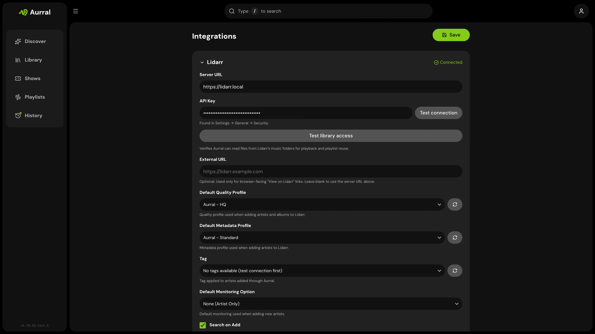

Aurral requires Lidarr. Aurral adds artists and albums, reads library state, and shows queue and history status through Lidarr.

## Connection

Enter these values in first-run setup or in **Settings > Lidarr**:

- The URL Aurral can reach (often `http://lidarr:8686` in Docker)
- Your Lidarr API key
- Default quality profile, metadata profile, tag, monitoring option, and search-on-add behavior
- Optional **Davo's Community Lidarr Guide** for quality profiles and file names

## Library access check

Aurral tests file access at each path that Lidarr reports. If the test fails, mount the Lidarr media root in Aurral.

See [Match Lidarr](/getting-started/storage/).

The check samples a track from an artist inside a root folder. It falls back to an artist outside them and then reports that the artist was left behind by a root folder change.

See [Library access fails on a folder that is not your root folder](/admin/troubleshooting/#library-access-fails-on-a-folder-that-is-not-your-root-folder).

In mixed Windows and Docker setups, **Test library access** shows the exact path that Lidarr reports.

If Aurral mounts that folder at a different path, add a mapping under **Settings > Download Clients > Remote Path Mappings**.

Path mappings let Aurral read files. If Navidrome uses a different path, enable **Use Navidrome paths in M3U files**.

Add a Navidrome mapping so that `.m3u` files use the correct paths.

See [Navidrome](/integrations/navidrome/#mixed-windows-and-docker-navidrome).

## Safety

Artist and album changes go through Lidarr. Aurral does not write directly into your root music library.

## Import list feeds

Each flow can provide a Lidarr Custom List URL.

1. Open the flow menu on **Playlists**.
2. Select **Lidarr import URL**.
3. In Lidarr, open **Settings > Import Lists > Custom List**.
4. Add the URL.

The copied URL uses the Aurral host in your browser. For example, the URL can start with `https://aurral.example.com/api/feeds/`.

Lidarr must be able to reach that host.

The URL includes a per-flow token. Treat it like a secret. Anyone with the URL can read that flow's artist list.

The feed always reflects the flow's current tracklist.

Aurral does not include tracks without a MusicBrainz artist ID in the feed. Aurral includes available album IDs.

Lidarr uses the IDs for **Specific Album** monitoring on versions that support album-level custom lists.
