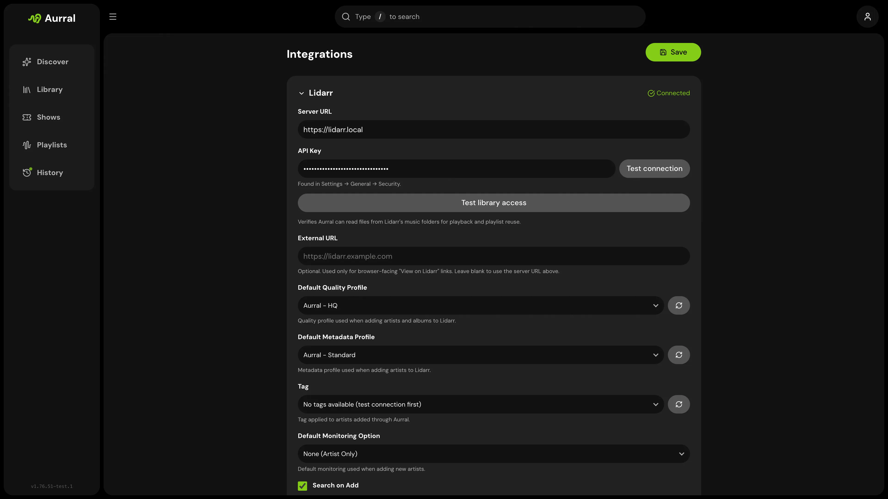

Lidarr is optional. Aurral can add and download artists and albums in its own Downloads Folder without Lidarr. Connect Lidarr when you want Lidarr to manage some or all of your artists and albums, or when you want Aurral to show Lidarr queue and history status.

The Lidarr integration has two parts:

1. Aurral connects to the Lidarr API.
2. Aurral reads the files at the paths that Lidarr reports.

The API connection can work while file access fails. Mount the same media root in Aurral and Lidarr at the same container path. See [Filesystem and mounts](/getting-started/storage/).

## Connect Lidarr

Connect Lidarr during first-run setup, or later in **Settings > Lidarr**.

1. Turn on **Enabled**.
2. Set **Server URL** to the Lidarr URL that the Aurral server can reach. In Docker, this is often `http://lidarr:8686`. Use HTTPS when the connection leaves your trusted network.
3. Enter the Lidarr **API key**.
4. Select **Test connection**.
5. Set the defaults for new artists: root folder, quality profile, metadata profile, tag, monitoring option, and **Search on add**.
6. Optional: set **External URL** to the Lidarr address that your browser uses. Aurral uses it only for links that open Lidarr in the browser.

To apply the quality profile, custom formats, and file naming from Davo's Community Lidarr Guide to Lidarr, select **Apply recommended settings** in the same tab. This action changes your Lidarr settings.

To stop Aurral from sending requests to Lidarr without removing the connection, turn off **Enabled**. Aurral keeps indexed Lidarr tracks in the Library, and stops watching and scanning the Lidarr root folders. When Lidarr is turned off, not configured, or not reachable, the Lidarr tab says which one applies.

## Import downloaded tracks

With **Import to Lidarr instead of the Aurral library** on in **Settings > Lidarr**, **Add to library** hands a track that Aurral already downloaded to Lidarr. Lidarr adds the artist and album without monitoring or searching, then moves the file into its root folder. Nothing is downloaded again. A track that is not downloaded yet is downloaded first and imported into Lidarr when it finishes. If that import fails, the file stays in the Downloads Folder. Off by default.

## Library display

Lidarr knows each artist's whole discography, including albums that you have not downloaded. **Show available music only** in **Settings > Lidarr** decides which albums the Library lists:

- **On**, the default. The Albums list, the Album Artists list, and the **Recently added** shelf show only albums with downloaded files. The library counts follow the same rule. An artist without downloaded music leaves the list, so an artist that you remove in Lidarr leaves the Library after the next scan.
- **Off.** The Library shows each artist's whole Lidarr discography, including albums without files, labelled for example `0/10 available`.

This setting changes only what the Library lists. You can still search for and request any album from the artist's discography.

## Add artists and albums

When Lidarr is connected, Lidarr manages your artists and albums, but the buttons stay the same. **Download album** asks Lidarr for the album. On an artist page, **Monitor** adds the artist to Lidarr with your Lidarr defaults and sets its monitoring. To choose the root folder, quality profile, tag, or monitoring for one artist, select **Customize add…** in the **Monitor** menu. Aurral keeps downloading tracks for playlists, flows, and single tracks.

When Lidarr downloads or monitors an album that Aurral has tracks from, Lidarr takes the album over. See [Who manages your library](/using/library/#who-manages-your-library).

## Metadata providers

Aurral uses the MusicBrainz ID in artist pages and links. It stores Lidarr's own artist ID separately.

If Lidarr uses another metadata provider, such as the Tubifarry Deezer or Discogs provider, Aurral checks that the Lidarr artist matches the MusicBrainz artist. It accepts names that MusicBrainz lists as aliases. It asks Lidarr which provider is active, and it retries an add with the correct provider ID when Lidarr rejects the ID format. Aurral also checks and fills in provider IDs for existing Lidarr artists when it reads the library.

If the artists do not match, search for the artist in Lidarr first, or switch Lidarr to MusicBrainz metadata.

## Library access check

To check that Aurral can read the Lidarr files, open **Settings > Storage health** and select **Run checks**. See the **Lidarr library** section. If the check fails, mount the Lidarr media root in Aurral. The recommended layout uses `/data` in both containers, with a Lidarr root folder such as `/data/music`.

The check reads one track of an artist inside a root folder. If no such artist exists, it reads a track of an artist outside the root folders, and reports that a root folder change left that artist behind. See [Library access fails on a folder that is not your root folder](/admin/troubleshooting/#library-access-fails-on-a-folder-that-is-not-your-root-folder).

In a mixed Windows and Docker setup, the check shows the exact path that Lidarr reports. If that path differs from the path inside Aurral, add a mapping in **Settings > Download clients > Remote path mappings**, with **Applies to** set to **Lidarr**.

This mapping only helps Aurral read Lidarr files. For Navidrome playlists, Navidrome must also scan the Lidarr music folder. See [When paths cannot match](/getting-started/storage/#when-paths-cannot-match).

## How Aurral indexes Lidarr files

Aurral saves the Lidarr root folders locally. It reads them again from the Lidarr `/rootFolder` endpoint when it connects, reconnects, or when the root folders change.

When a file changes in a Lidarr root folder, Aurral scans that file on local disk. The scan does not ask Lidarr for artist, album, track, or track file data. The file must be readable at the saved root folder path. The Library uses the MusicBrainz IDs from the file tags and the provider IDs from Lidarr.

If a file does not appear in **Library**, select **Refresh** there. Refresh waits for the scan to finish. If the file still does not appear, run the storage checks and look for a path mismatch.

If Lidarr fails during a refresh, Aurral retries the scan instead of reporting it complete, and writes the error to the server log. A timeout error names the request method, the endpoint, and the configured timeout.

## Request availability notifications

To send **Request available** notifications as soon as Lidarr imports an album, add a webhook in **Lidarr > Settings > Connect**:

1. Add a **Webhook** connection.
2. Set the URL to `https://aurral.example.com/api/webhooks/lidarr`. Use an Aurral address that Lidarr can reach.
3. Turn on the **On Import** event.
4. Add an `X-Api-Key` header with the Aurral API key from **Settings > System**.

Aurral accepts other Lidarr webhook events but ignores them. It updates request history only for the import event, which Lidarr sends as `Download`, and only for albums that users requested in Aurral. The Gotify and webhook event switches in Aurral still decide which notifications go out.

## What Aurral changes

Changes to Lidarr artists and albums go through the Lidarr API. Changes to Aurral artists and albums write to the Downloads Folder. Aurral never writes into a Lidarr root folder.

## Import list feeds

Each flow can publish a URL that Lidarr reads as a **Custom List**.

1. On **Flows**, open the flow, then open the flow menu.
2. Select **Copy Lidarr import URL**.
3. In Lidarr, open **Settings > Import Lists** and add a **Custom List**.
4. Paste the URL.

The copied URL uses the Aurral address in your browser, for example `https://aurral.example.com/api/feeds/...`. Lidarr must be able to reach that address.

:::caution
The URL contains a token for that flow. Treat it as a secret. Anyone with the URL can read the artist list of the flow.
:::

The feed always matches the flow's current tracklist. It leaves out tracks without a MusicBrainz artist ID. It includes album IDs when they are known. Lidarr versions that support album-level custom lists use these IDs for **Specific Album** monitoring.
