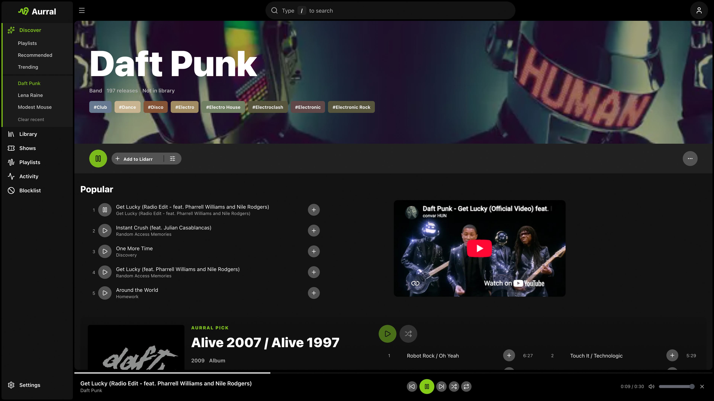

Navidrome is optional. Aurral creates an **Aurral Playlists** library at the `aurral-weekly-flow` path.

Aurral also writes M3U playlists for your flows and static playlists.



## Setup

1. Mount the same media volume in Aurral and Navidrome at the same container path. For the usual `/data` layout:

   ```yaml
   # Aurral
   volumes:
     - data:/data

   # Navidrome
   volumes:
     - data:/data:ro
   ```

   If Navidrome already uses `/music`, also mount the Aurral folder at the path Aurral uses:

   ```yaml
   - data/downloads/aurral:/data/downloads/aurral:ro
   ```

2. Set Aurral's **Downloads Folder > Path** to a folder under `/data`, such as `/data/downloads/aurral`.
3. Connect Navidrome in **Settings > Playback > Navidrome** and save.
4. Aurral creates the **Aurral Playlists** library, writes its playlist files under `aurral-weekly-flow`, and requests a Navidrome scan. You do not need to create this library manually in Navidrome.

Aurral configures Navidrome through its API. Navidrome must also have access to the audio files on disk.

Aurral embeds playlist metadata into new yt-dlp downloads. On startup, it also repairs older yt-dlp M4A files that have missing or incorrect title, artist, or album tags, then schedules a Navidrome library scan.

## Mixed Windows and Docker Navidrome

Aurral writes M3U playlists under `aurral-weekly-flow` with one track path per line. Navidrome must be able to open those paths on its filesystem.

| Navidrome deployment | Playlist path mode | Setting |
| -------------------- | ------------------ | ------- |
| Docker, same mounts as Aurral | **local** (default) | Leave **Use Navidrome paths in M3U files** off |
| Docker, different mount path than Aurral | **remote** | Enable the Navidrome setting and add a path mapping, or set `M3U_PATH_MODE=remote` plus `M3U_PATH_MAPPINGS` |
| Native Windows while Aurral is in Docker | **remote** | Enable the Navidrome setting and add a path mapping, or set `M3U_PATH_MODE=remote` plus `M3U_PATH_MAPPINGS` |

### What remote mode does

Path mappings translate Lidarr Windows paths into Aurral container paths. Aurral can then read the files.

For example, `N:\ServerFolders\Music\Music\Artist\track.mp3` becomes `/music/Music/Artist/track.mp3` in Docker.

By default, M3U files use Aurral's container paths. Navidrome cannot resolve `/music/...` if it runs natively on Windows.

The same problem occurs if the Navidrome container uses a different path for the files. Playlists can appear, but tracks do not play.

**Use Navidrome paths in M3U files** changes paths only in M3U files. You can also set `M3U_PATH_MODE=remote`.

Aurral still uses container paths for file checks, reuse, and repairs.

### Example (Aurral in Docker, Navidrome on Windows)

```yaml
services:
  aurral:
    environment:
      - PATH_MAPPINGS=N:/ServerFolders/Music|/music
      - M3U_PATH_MODE=remote
      - M3U_PATH_MAPPINGS=/music|N:/ServerFolders/Music
    volumes:
      - N:/ServerFolders/Music:/music
      - ./config:/config
```

Set **Downloads Folder > Path** to a path under `/music`. For example, use `/music/Aurral`.

After you enable remote mode, refresh each affected playlist.

Run the flow again. For a shared playlist, edit the playlist and then save it.

See also [Match Lidarr: Windows and mixed Docker setups](/getting-started/storage/#windows-and-mixed-docker-setups).

## Recommended Navidrome setting

```bash
ND_SCANNER_PURGEMISSING=always
```

`ND_SCANNER_PURGEMISSING=always` removes old flow entries after a flow changes.

:::caution
`ND_SCANNER_PURGEMISSING=always` also removes other missing Navidrome files. It removes their ratings, play counts, and playlist entries.

Use this setting only when missing files will not return.
:::

For Plex and Plexamp instead, see [Plex](/integrations/plex/).
