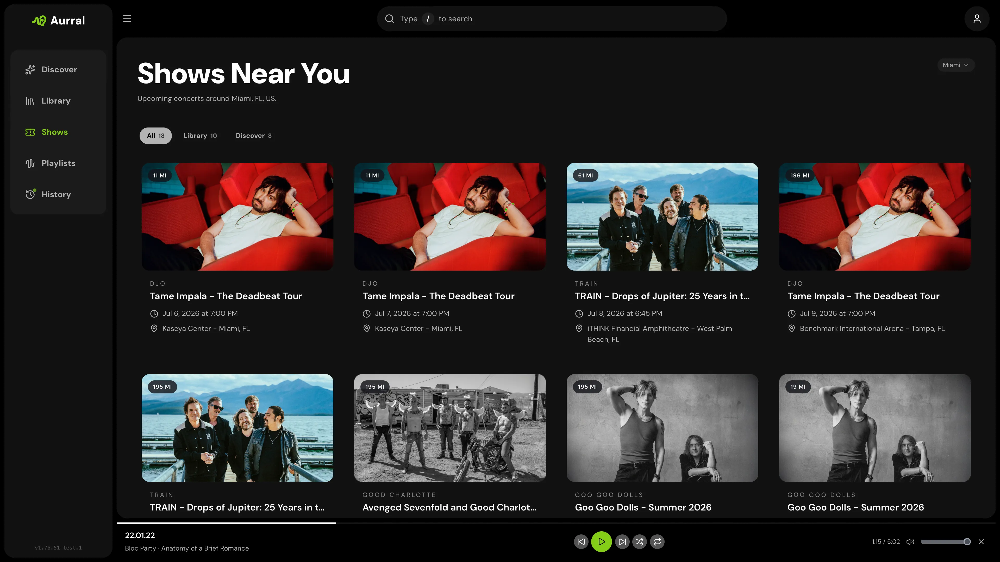

Ticketmaster is optional. With it, Aurral shows nearby events for library, recommended, and trending artists.

## Setup

1. Open **Settings > Connect > Ticketmaster**.
2. Enter your Ticketmaster **Consumer key**.
3. Set **Search radius (miles)**.
4. Under **Local discovery**, choose whether shows also include recommended artists and trending artists.

Aurral shows an event when a performer's name matches an artist name. Matching ignores case, accents, punctuation, spacing, and a leading "The". Names that only contain an artist's name do not match, so a library artist named Genesis does not match Genesis Owusu, and tribute acts are left out.

Each user can let Aurral detect their location, or enter a ZIP code or postal code. If several countries use the same postal code, also enter the two-letter country code, for example `FR` for `75001` in France.
