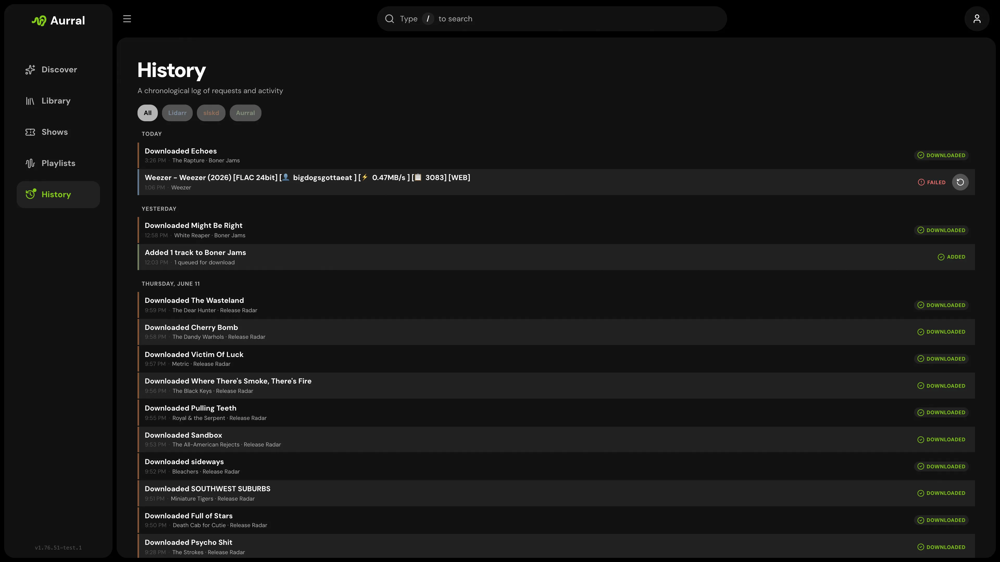

**Activity** shows the work that Aurral does for you. It has two views:

- **Queue** lists album requests, queued and active downloads, playlist imports, and tracks that wait for your review.
- **History** lists finished, denied, and failed work.

**Wanted** in the sidebar lists Aurral tracks that need more work. It has two filters:

- **Missing** lists tracks whose download failed.
- **Cutoff unmet** lists tracks with files below your quality cutoff.

To see the details of any row in Activity or Wanted, select its info action.

## Queue

**Queue** shows active work, including playlist imports that have not started yet. A track stays in the queue when it waits for your decision, for example when its duration or identity is unclear.

For a track that Aurral downloads for an album, select **Open** to go to the album page. That page shows the download state and lets you cancel or retry.

### Album downloads

When Aurral downloads a whole album release at once, Activity shows its tracks in one album row. Expand the row to see each track's status and review controls.

- The row shows how many tracks are ready.
- The row stays in **Queue** while any track is active or waits for review.
- In **History**, the row shows **Completed** only when every track is ready. A failed or missing track leaves the album incomplete.

If Aurral falls back to downloading tracks one by one, those tracks stay in the same album row. The info action shows the reason for the fallback and the download sources. A request that only ever downloads track by track shows one row for each track.

### Review a track

Aurral holds a download for review when the file looks like the requested track but its duration is wrong. It does not try another source at once.

Each review row shows the requested track, artist, and album, the path of the downloaded file, the match scores, and the duration. Preview the track, then approve or deny it.

## History

**History** shows finished, denied, and failed work.

When an album request to Lidarr fails, you can retry the search from **History** if the row offers it. For an album that Aurral manages, use **Retry** on the album page.

Aurral stores who requested each album. Activity can show the requester, and other tools can filter requests by user. If you use Lidarr, its import webhook can mark a requested album as available as soon as Lidarr imports it. See [Lidarr](/integrations/lidarr/#request-availability-notifications).

## Wanted

**Wanted** includes every Library track that Aurral manages, the tracks in your playlists, and the tracks in the flows that you can open.

- To search again for one missing track, select **Re-search track** on its row.
- To search for a better file for one track, select **Search for upgrade** on its row in **Cutoff unmet**.
- To search for every track in the current filter, select **Search all**.

A row in **Cutoff unmet** changes to **Upgrade queued** at once, and keeps that state after a page refresh. Follow the searches in **Queue** and their results in **History**.

### Choose a download yourself

Automatic search picks a result for you. When it picks the wrong one, or none, you can choose the file yourself.

1. In **Wanted > Missing**, select **Choose a download manually** on a track.
2. In **Download client**, select a client. The list shows the configured clients: Soulseek, deemix, yt-dlp, and Usenet through SABnzbd or NZBGet.
3. Select **Search**. Aurral shows up to 100 results from that client.
4. Select one result, then select **Download selected**.

To replace a finished track in a flow or static playlist, right-click it and select **Re-search > Manual**. The same window opens.

A manual choice works differently from an automatic search:

- Aurral downloads only the result that you chose. If that download fails, the job fails. Aurral does not try other results or other clients.
- Aurral does not check the title, artist, album, or duration of the file.
- Aurral still requires readable audio with a known quality. It accepts quality tiers that your profile turns off.
- Search results expire after 10 minutes. If they expire, search again.

## Download client setup

See [yt-dlp](/integrations/ytdlp/), [slskd](/integrations/slskd/), [deemix](/integrations/deemix/), and [Usenet](/integrations/usenet/).
