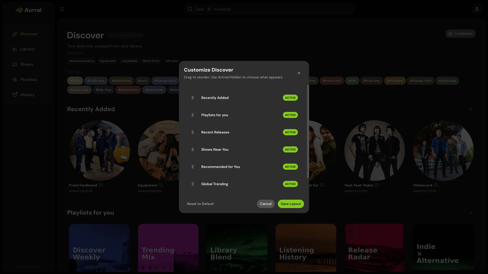

Discover is Aurral's home screen. It shows personalized recommendations, global trends, tags, recent releases, discover playlists, artist news, and recently added artists.

When you configure Ticketmaster, Discover also shows nearby events.

Discover uses your library data. Aurral tries to recommend artists that fit your taste but are not in your library.

## What shapes recommendations

- Your Lidarr library
- Your Last.fm, ListenBrainz, or Koito listening history
- Last.fm tags and similar artists
- Global trending pools
- Recent releases
- Your feedback on recommendations

**More like this** and **Less like this** change the importance of related artists. These actions do not permanently exclude artists.

**Block artist** excludes an artist for one user. Aurral removes that artist from recommendations, playlist previews, and future downloads.

Manage the list from **Blocklist** in the sidebar.

## Discovery modes

| Mode     | Best for                                                  |
| -------- | --------------------------------------------------------- |
| Safer    | Familiar, high-confidence recommendations                 |
| Balanced | A mix of familiar picks and exploration                   |
| Deeper   | More exploration outside your usual library                |

You can customize which sections appear on your Discover page and reorder them per user.

## Artist news

When **News** is enabled in **Settings > RSS News**, Discover shows recent stories from the configured RSS feeds when they mention artists in your Lidarr library or recommended artists. Aurral combines the feeds locally, removes duplicate stories, and matches artist names before showing an article.

Select the arrow on the **Artist News** section, or **News** in the sidebar, to open the full news page. Aurral refreshes enabled RSS feeds in the background and keeps recent results in the local database. If a feed does not provide an article photo, Aurral uses the available image fallback. Select the disable icon beside an article's publisher to turn that RSS feed off in **Settings > RSS News**.

## Discover playlists

Aurral can generate playlists such as Release Radar from your listening context. These playlists appear in Discover.

You can add them to your Playlists library for downloads and playback.

## Per-user listening history

Each user sets a listening-history provider in **Profile**. Select **Local only**, enter a Last.fm
or ListenBrainz username, or enter a Koito instance URL. Aurral uses local play events for every
profile and adds external history when the selected provider supplies it.

Aurral uses this value to make personal recommendations on a shared instance.

## Shows

When you configure Ticketmaster, Discover can show nearby events for recommended, trending, and library-adjacent artists.
