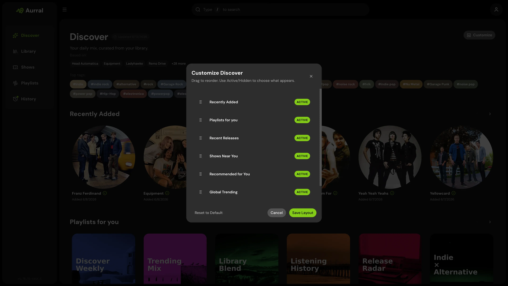

Discover is Aurral's home page. It shows personal recommendations, trending artists, tags, recent and upcoming releases, discover playlists, artist news, and recently added artists. When an admin configures Ticketmaster, Discover also shows nearby events.

Aurral recommends artists that fit your taste but are not in your Library yet. It uses your Library, your listening history, and discovery data from Last.fm and other sources.

## What shapes recommendations

- The artists in your Library
- Your listening history in Aurral, and from Last.fm, ListenBrainz, or Koito
- Last.fm tags and similar artists
- Global trending artists
- Recent releases
- Your feedback on recommendations

**More like this** and **Less like this** change how much weight Aurral gives to related artists. They do not exclude an artist.

**Block artist** excludes an artist for you only. Aurral removes that artist from your recommendations, playlist previews, and future downloads. To manage the list, open **Blocklist** in the sidebar.

## Discovery modes

An admin sets the mode in **Settings > Discover**.

| Mode | Best for |
| --- | --- |
| Safer | Familiar recommendations with high confidence |
| Balanced | A mix of familiar picks and new ground |
| Deeper | More artists outside your usual library |

## Customize the page

To choose and order the sections on your Discover page, select **Customize Discover**. Each user has their own layout.

## Recent and upcoming releases

**Recent & Upcoming Releases** lists new and upcoming albums from library artists that have a MusicBrainz ID. Aurral builds this list from BrainzMash, its hosted metadata service. Lidarr is not required.

Aurral refreshes the list when it starts, once a day, after each library scan, and when you add an artist. It leaves out albums that are already in your Library. If BrainzMash is unavailable, Aurral keeps the last list that it loaded.

To add a release to your Library, select its add button. Aurral uses your default library manager. See [Choose a library manager](/using/library/#choose-a-library-manager).

## Artist news

When an admin turns on news in **Settings > RSS news**, Discover shows recent stories that mention library artists or recommended artists. Aurral merges the enabled feeds, removes duplicate stories, and matches artist names before it shows a story.

To open the full news page, select the arrow on the **Artist News** section, or **News** in the sidebar. If a feed has no photo for a story, Aurral uses a fallback image. To turn off a feed, select the disable icon beside the publisher name on a story.

## Open artists and albums

Select an artist or album card to open its Discover page. If the artist or album is in your Library, select **Open in library** to open its Library page. There you can play tracks and mark favorites.

## Discover playlists

Aurral builds playlists such as Release Radar from your listening history. They appear in Discover.

You can adopt a discover playlist as a flow or as a static playlist. The adopted playlist belongs to the user who adopted it.

Open an editorial playlist to play the Deezer previews for its tracks.

## Per-user listening history

Each user chooses a listening-history provider in **Profile > Listening history**. Choose **Local only**, enter a Last.fm or ListenBrainz username, or enter a Koito URL. Aurral always uses the plays recorded in Aurral, and adds history from the selected provider.

This lets each user on a shared server get their own recommendations.

## Shows

When an admin configures Ticketmaster, Discover shows nearby events for recommended, trending, and library artists. See [Ticketmaster](/integrations/ticketmaster/).
