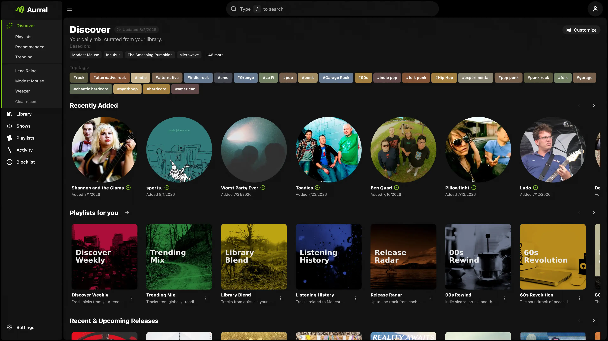
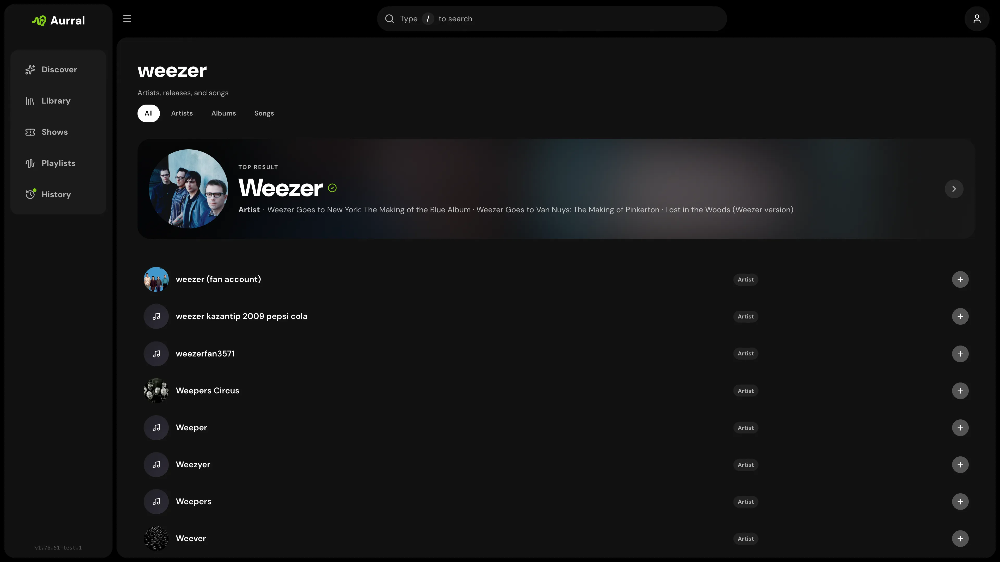
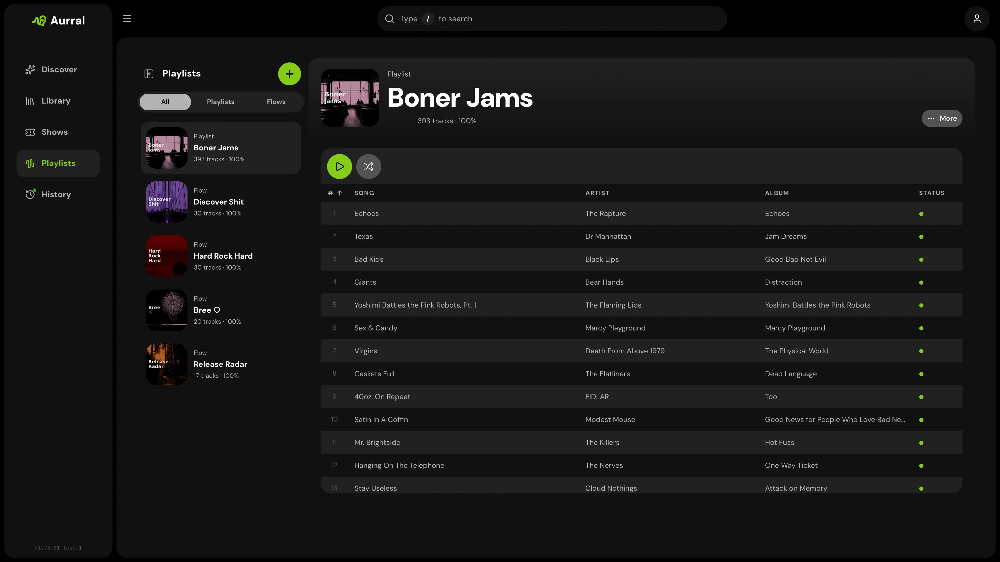
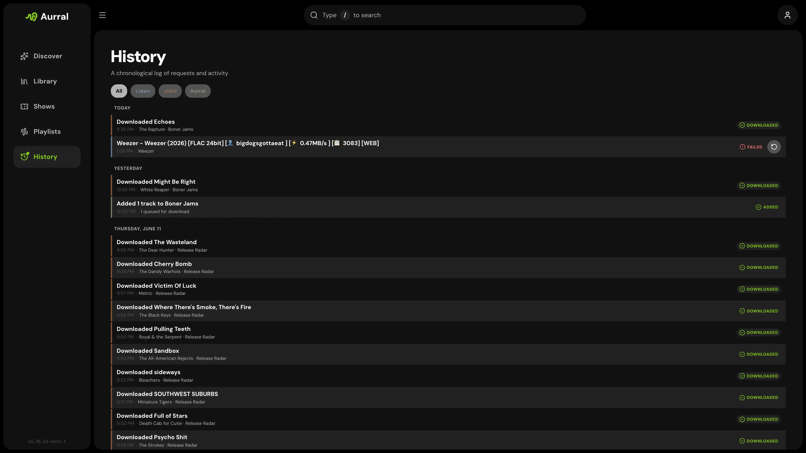
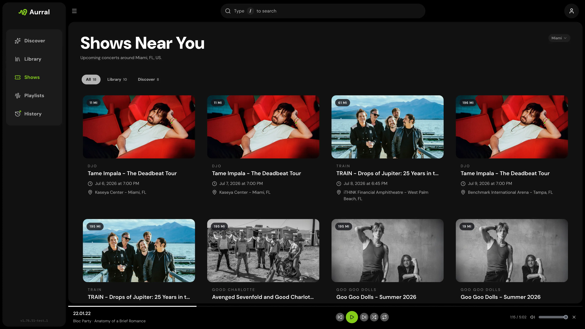
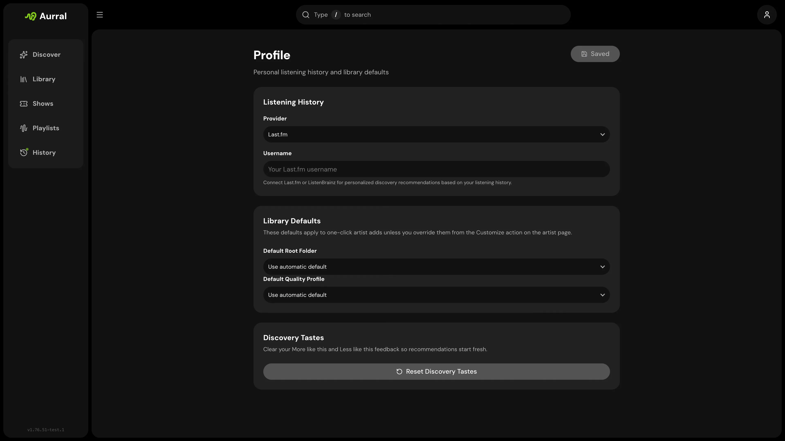
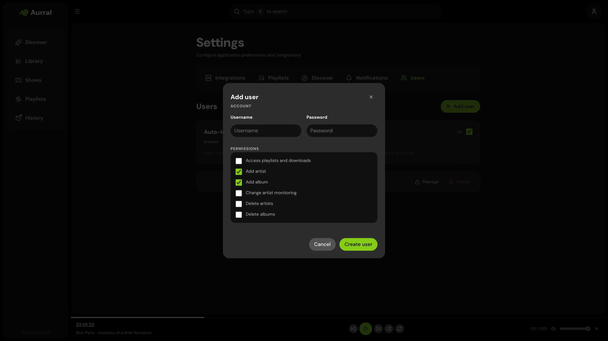

Aurral is a Lidarr companion for music discovery. It connects to your existing library.

## Main sections

### Discover

Discover shows recommendations, trends, tags, recent releases, playlists, new artists, and nearby shows.

Each user can select and arrange the sections.

### Search

Use Search to find artists and albums. You can preview tracks, check library status, and add items to Lidarr.

### Library

Library shows the artists in Lidarr. It includes search, sort controls, artwork, monitoring status, and artist pages.

### Playlists

Playlists contains scheduled flows, Spotify imports, discover playlists, in-app playback, and download status.

Flows regenerate on a schedule. Static playlists keep fixed tracklists or synchronize with Spotify.

### Activity

Activity shows active Lidarr requests, download client activity, and Aurral playlist jobs.

The History tab shows completed and failed events.

### Blocklist

Manage the artists that Aurral excludes from recommendations, playlist previews, and future playlist downloads.

### Shows

When you configure Ticketmaster, this section shows nearby concerts for specified artists.

### Profile

Profile contains listening history, Lidarr defaults, and personal preferences. Aurral supports Last.fm, ListenBrainz, and Koito history.

### Settings

Settings contains the admin configuration. The page has these tabs:

| Tab                  | What it covers                                                      |
| -------------------- | ------------------------------------------------------------------- |
| **System**           | Downloads folder, path mappings, general settings, cover art        |
| **Tasks**            | Active and stale worker task management                             |
| **Lidarr**           | Lidarr connection, profiles, tags, library access check             |
| **Indexers**         | Prowlarr connection, indexer management, search priorities          |
| **Download Clients** | yt-dlp, slskd, SABnzbd, NZBGet, source priority, format preferences |
| **Playback**         | Navidrome and Plex                                                  |
| **Discover**         | Recommendation refresh, mode, and generated playlists              |
| **Connect**          | Gotify, webhooks, Last.fm, and Ticketmaster                         |
| **Users**            | Accounts and permissions                                            |

Settings and Profile changes save automatically after you edit them. Connection tests and sync
actions remain separate actions.

Advanced metadata settings are available at `/settings/metadata`. They do not appear in the main settings navigation.
