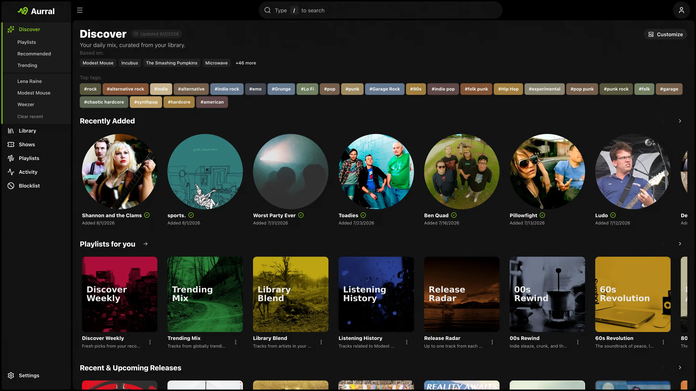
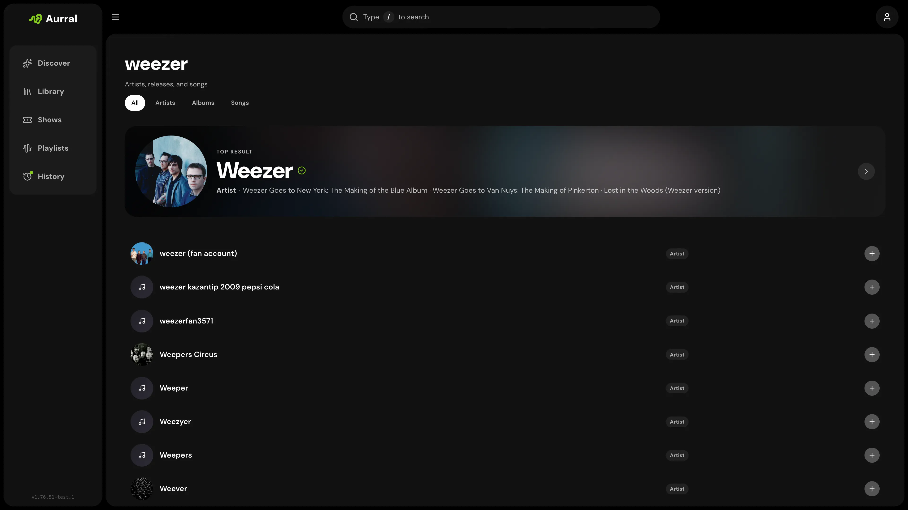
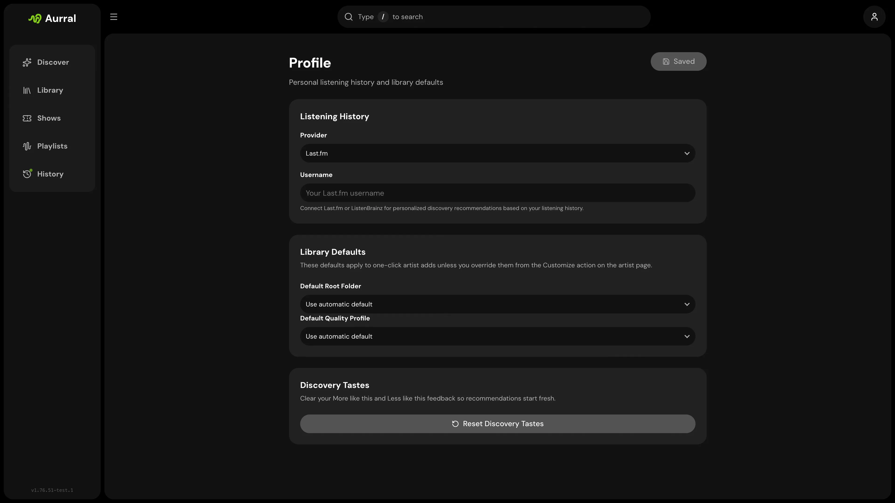
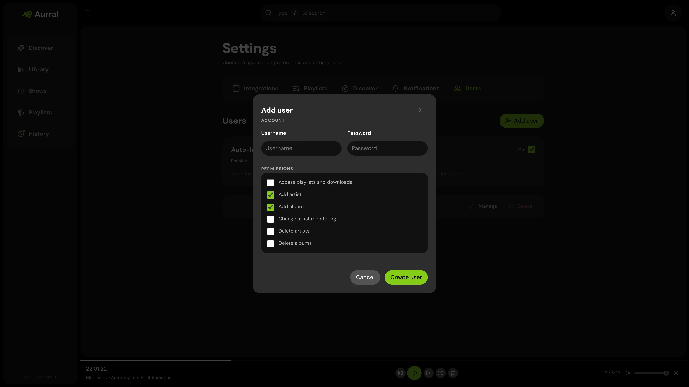

Aurral indexes the music in its Downloads Folder and, if you connect Lidarr, in the Lidarr root folders. This page describes each part of the app.

## Main sections

### Discover

Discover shows recommendations, trending artists, tags, recent and upcoming releases, playlists, artist news, and nearby shows. Each user chooses which sections appear and in what order. See [Discover](/using/discover/).

### Inbox

The bell icon beside the profile menu opens the Inbox. It collects new releases from library artists, nearby shows, artist news, and new discoveries. Each user has their own read, saved, dismissed, and added state. See [Inbox](/using/inbox/).

### Search

Search finds artists, albums, and tags. From the results, you can preview tracks, see what is already in the Library, and add an artist or album.

Matches from your Library appear first, in their own section, and open the Library page. Results from the metadata catalog follow under **Discover**.

### Library

Library lists the artists, albums, and tracks that Aurral has indexed. You can search, sort, play tracks, mark favorites, and open artist and album pages. See [Library](/using/library/).

Each artist and album has one library manager, Aurral or Lidarr:

- Aurral keeps its files in the Downloads Folder. Aurral searches for and downloads them.
- Lidarr keeps its files in its root folders. Lidarr searches for and downloads them.

Artist and album pages have a Discover view and a Library view. Select **Open in library** or **Open in Discover** to switch between them.

Aurral or Lidarr can also monitor an artist and download its new albums. See [Monitor music](/using/library/#monitor-music).

### Playlists and Flows

**Library > Playlists** holds your static playlists and their download status. **Flows** in the sidebar holds your scheduled discovery mixes.

A flow builds a new tracklist on a schedule. A static playlist keeps a fixed tracklist, or follows a Spotify, YouTube Music, Deezer, Last.fm, or ListenBrainz playlist. You can play both in Aurral. Navidrome, Plex, Jellyfin, and other Subsonic clients are optional. See [Playlists overview](/using/playlists/).

### News

**News** in the sidebar lists recent stories from your RSS feeds that mention library artists or recommended artists. An admin turns on news in **Settings > RSS news**.

### Activity and Wanted

**Activity** shows downloads, album requests, and playlist jobs. **Queue** lists active work and tracks that wait for your review. **History** lists finished, denied, and failed work.

**Wanted** lists Aurral tracks that are missing or below your quality cutoff. From there, you can search again, choose a download yourself, or search for an upgrade. See [Activity](/using/activity/).

### Blocklist

The blocklist holds the artists that you excluded. Aurral removes them from recommendations, playlist previews, and future playlist downloads.

### Shows

When an admin configures Ticketmaster, **Shows** lists nearby concerts for library, recommended, and trending artists.

### Profile

Profile holds your personal settings:

- **Appearance.** Choose a built-in palette, and **System**, **Light**, or **Dark** mode. Aurral saves the choice on the current device. You can also browse terminal.sexy color schemes. A light and a dark version of one scheme share one card and follow the selected mode. Use **Find a scheme** to search the collection and add schemes to your list.
- **Listening history.** Choose **Local only**, Last.fm, ListenBrainz, or Koito.
- **Connected accounts.** Link a Google or Plex account that you can use to sign in. See [Users and authentication](/admin/users/#sign-in-with-google-or-plex).
- **Plex account.** Link your own Plex account for your playlists.
- **Library defaults.** Choose your **Default library manager**, and your default Lidarr root folder and quality profile.
- **Discovery tastes.** Reset your recommendation feedback, or open your blocklist.

### Settings

Settings holds the admin configuration. It has these tabs:

| Tab | What it covers |
| --- | --- |
| **System** | Runtime details, date format, Subsonic behavior, and the API key |
| **Storage health** | Checks for storage, downloads, Lidarr files, path mappings, and playback |
| **Tasks** | Scheduled jobs, workers, and the job queue |
| **Lidarr** | Lidarr connection, the **Enabled** switch, defaults, and library display |
| **Indexers** | Prowlarr connection, indexers, and indexer priorities |
| **Download clients** | Quality profile, Downloads Folder, remote path mappings, and download clients |
| **Playback** | Navidrome, Plex, Jellyfin, scrobbling, and cover art |
| **Connect** | Gotify, webhooks, Last.fm, Ticketmaster, Google sign-in, and Inbox |
| **RSS news** | RSS feeds and feed groups |
| **Discover** | Recommendation refresh and discovery mode |
| **Users** | Accounts, permissions, account status, sign-in mode, and local-network auto-login |

Use the search field in Settings to find a setting by name.

Settings and Profile save each change automatically. Connection tests and sync actions have their own buttons.

To set the date and time format for all users, open **Settings > System > Display**. Choose the browser default, day first, or year first.

Advanced metadata settings are at `/settings/metadata`. This page is not in the Settings navigation. See [Metadata and search](/integrations/metadata/).

Release catalogue refreshes have a separate worker in **Settings > Tasks**, so a slow metadata provider does not hold up playlist maintenance. An **Interrupted** run means unfinished work was returned to the queue after shutdown or loss of its execution lease.
