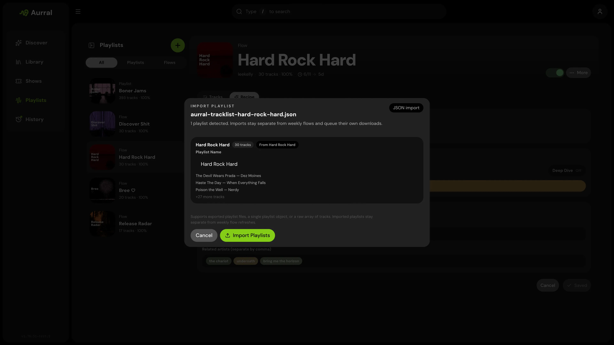

An imported playlist is a static playlist. It differs from a flow:

- It does not use a source mix, Focus, or Deep Dive.
- A Spotify, YouTube Music, Deezer, Last.fm, or ListenBrainz import can sync on its own schedule. A synced import keeps the same tracks as the provider.
- A JSON import keeps the exact tracklist that you imported.
- It can reuse finished Aurral tracks and existing Lidarr files instead of downloading them again.



All imports start in the same place. On **Library > Playlists**, open the create menu and select **Import playlist**.

## Sync schedule and removed tracks

Each provider import has a sync schedule. Choose **None** for a fixed tracklist. To change the schedule later, use **Auto-sync** in the playlist menu. To sync at once, select **Sync now**.

A sync reads the provider playlist again. Aurral removes the tracks that are gone and queues the new tracks.

By default, a track that the provider removes leaves the Aurral playlist, but its file stays in the Library. To delete the file instead, turn off **Keep removed tracks in library** during the import or in the playlist menu. Aurral then deletes the file if no other playlist uses it. It never deletes Lidarr files or other external files. The setting applies to future syncs.

## Import from Spotify

1. Select **Spotify**.
2. Select **Connect Spotify**.
3. Approve access in the pop-up window.
4. Select a playlist.
5. Set a display name and a sync schedule.
6. Start the import.

If your browser blocks the pop-up window, allow it. The Aurral server must serve `oauth.html`.

Spotify returns playlist items in pages of up to 50. Aurral reads every page, so a very large playlist takes longer to sync. If Spotify reports more items than Aurral received, the sync fails and Aurral keeps the saved tracklist. Spotify gives item details only for playlists that you own or collaborate on.

Aurral stores one Spotify connection for each user. To revoke access, select **Disconnect** in the import window.

If Spotify expires or revokes the connection, Aurral disconnects it and pauses your synced Spotify playlists. When you next open Aurral, a **Spotify disconnected** message appears. Select **Reconnect** to open the import window and connect again.

## Import from YouTube Music

You can import a public YouTube or YouTube Music playlist. You do not need a Google account or an API key.

1. Select **YouTube Music**.
2. Paste an HTTPS playlist URL from `youtube.com` or `music.youtube.com`.
3. Load the preview.
4. Set a name and a sync schedule.
5. Start the import.

Aurral loads every page of the playlist before it shows the preview or changes a synced playlist. If YouTube returns an incomplete or repeated page, times out, or is unavailable, Aurral keeps the playlist tracks and files as they are. Load the preview again, or select **Sync now** later. If YouTube Music limits Aurral's requests, Aurral pauses its requests for a short time.

The preview shows how many tracks Aurral can import and how many it skips. Aurral skips unavailable entries, podcasts, rows without an artist or title, and duplicates. For a music video, Aurral uses the first author of the video as the artist, and the track can have no album.

Aurral supports public playlists. An unlisted playlist can work when YouTube allows anonymous access. Aurral cannot import private playlists, **Liked Music**, your library, or personal account playlists, because they need a Google sign-in.

This import supplies only the tracklist. Your download clients find and download the tracks.

## Import from Last.fm

The Last.fm tab offers three stations: **Library**, **Mix**, and **Recommended**.

1. Select **Last.fm**.
2. If Aurral does not show your username, enter it. Aurral fills it in when Last.fm is your listening-history provider in **Profile**.
3. Select a station.
4. Start the import.

Aurral saves the username with the playlist for future syncs. A synced station follows Last.fm as the station changes.

## Import from ListenBrainz

Before you import, link ListenBrainz in **Settings > Playback > Scrobbling**. Aurral uses the same user token.

1. Select **ListenBrainz**.
2. Select a playlist.
3. Start the import.

The list shows the playlists that you own, and two generated playlists: **Weekly Jams** and **Weekly Exploration**. It leaves out the dated snapshots from **Created for you**.

**Weekly Jams** and **Weekly Exploration** always point to the newest generated playlist. Aurral finds the newest one each time it previews, imports, or syncs. Another playlist that you own always syncs that one playlist.

## Import a JSON file

To import a Spotify playlist without connecting Spotify:

1. Export the playlist with [Exportify](https://exportify.net/).
2. Convert the file with the [Spotify CSV converter](/tools/spotify-csv-converter/).
3. Import the JSON file on the **JSON file** tab.

Aurral also accepts output from [CSVJSON](https://csvjson.com/csv2json). It reads Spotify column names such as `Track Name`, `Artist Name(s)`, and `Album Name`.

### Accepted file shapes

The importer accepts these JSON shapes:

1. An exported Aurral playlist file
2. One playlist object with a `tracks` array
3. An array of tracks
4. An object with a `playlists` array
5. An object with a `playlist` property that holds one playlist

Aurral reads a top-level array of tracks as one playlist, and a top-level array of playlists as several playlists.

### Track fields

Each track needs an artist and a track name. These keys are accepted:

| Field | Accepted keys |
| --- | --- |
| Artist | `artistName`, `artist`, `artist_name`, `Artist Name(s)` |
| Track | `trackName`, `title`, `name`, `track`, `Track Name` |
| Album, optional | `albumName`, `album`, `Album Name` |
| Artist ID, optional | `artistMbid`, `artistId`, `mbid` |

The smallest valid track:

```json
{
  "artistName": "Burial",
  "trackName": "Archangel"
}
```

### Examples

An exported Aurral playlist file:

```json
{
  "type": "aurral-static-tracklist",
  "version": 1,
  "exportedAt": "2026-03-25T12:00:00.000Z",
  "name": "Late Night Finds",
  "sourceName": "Friday Flow",
  "sourceFlowId": "abc123",
  "trackCount": 2,
  "tracks": [
    {
      "artistName": "Burial",
      "trackName": "Archangel",
      "albumName": "Untrue",
      "artistMbid": null
    },
    {
      "artistName": "Four Tet",
      "trackName": "Two Thousand and Seventeen",
      "albumName": null,
      "artistMbid": null
    }
  ]
}
```

One playlist object:

```json
{
  "name": "My Playlist",
  "tracks": [
    { "artistName": "Massive Attack", "trackName": "Teardrop" },
    { "artistName": "Portishead", "trackName": "Roads" }
  ]
}
```

An array of tracks:

```json
[
  { "artistName": "Burial", "trackName": "Archangel" },
  { "artistName": "Air", "trackName": "La Femme d'Argent" }
]
```

Several playlists:

```json
{
  "playlists": [
    {
      "name": "Warm",
      "tracks": [{ "artistName": "Bonobo", "trackName": "Kiara" }]
    },
    {
      "name": "Dark",
      "tracks": [{ "artistName": "Burial", "trackName": "Near Dark" }]
    }
  ]
}
```

A `playlist` wrapper:

```json
{
  "playlist": {
    "name": "Imported Set",
    "tracks": [{ "artistName": "Air", "trackName": "La Femme d'Argent" }]
  }
}
```

## What happens after an import

- If the name is already in use, Aurral renames the imported playlist.
- The playlist queues its own downloads. It does not change any flow.
- **Activity > Queue** shows the import and its tracks at once, before the worker starts them.
- When Aurral reuses an existing file, it marks the track as complete at once.
- The playlist keeps the imported track order, in Aurral and in Navidrome.

## Moving and removing selected tracks

Select tracks in a static playlist, then choose **Move** or **Remove selected**.
Aurral queues the selection as one action and reports completion separately.
If some tracks fail, their source memberships remain available. Review the result
before retrying. A move saves the destination membership before removing the source.
If the destination already contains a separate membership for a selected track,
Aurral keeps the source and reports that track as failed.

Removing a track or its original playlist preserves downloads and files that
another static playlist still uses. If a request times out, check the playlists
before submitting it again because the action may already be queued.

## Download retries and failures

A static playlist handles failed downloads differently from a flow:

- Aurral queues each track as a separate job.
- The download worker can try several candidates and several download sources.
- If all of them fail, the track stays failed, also after a restart.
- To search again, right-click the track and select **Re-search**.
- To replace a finished track that Aurral downloaded, right-click it and select **Re-search**. Aurral keeps the current file until the replacement passes its checks.
- A static playlist never swaps a failed track for a different track. Only flows do that.

## Reuse existing files

One file can belong to several playlists. Aurral does not download a track again when a usable file exists.

- Reuse does not change the track order. A track that you already have keeps its place while the missing tracks download.
- If you add a flow track to a static playlist, both playlists use the same file. When the flow refreshes, Aurral keeps the file for the static playlist.
- Aurral prefers files from static playlists and from Lidarr.
- Before Aurral removes a playlist, it moves shared files to a playlist that still uses them. Navidrome does not show duplicate files.

To reuse Lidarr files, Aurral must read them at the paths that Lidarr reports. Mount the same media root at the same container path in both services, for example `/data` with the Lidarr root folder `/data/music`. See [Filesystem and mounts](/getting-started/storage/).

If Lidarr runs on Windows and Aurral runs in Docker, run **Settings > Storage health > Run checks**. The **Lidarr library** section shows the path that Lidarr reports. Add a mapping for that path in **Settings > Download clients > Remote path mappings**.

Navidrome must scan the Lidarr library before Aurral can add a reused track to a Navidrome playlist. See [Navidrome: Existing Lidarr library](/integrations/navidrome/#existing-lidarr-library).
