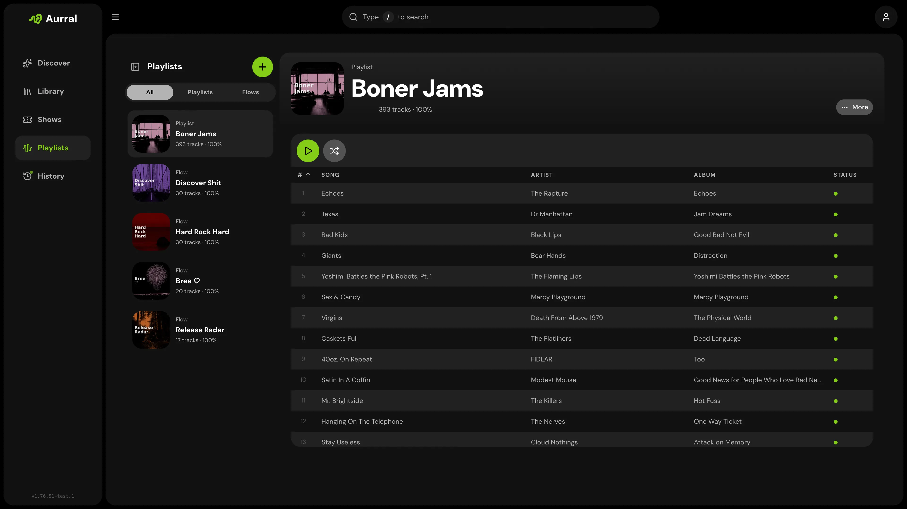

Aurral has two kinds of playlist:

- A **flow** builds a new tracklist on a schedule. Its files are temporary. Open **Flows** in the sidebar to see your flows.
- A **static playlist** keeps a fixed tracklist, or follows a playlist from another service. Open **Library > Playlists** to see your static playlists.

## Flows compared with static playlists

| | Flows | Static playlists |
| --- | --- | --- |
| Tracklist | Built again on a schedule | Fixed at import, or follows a provider |
| Failed downloads | Replaced with other tracks | Stay failed until you search again |
| Settings | Schedule, source mix, Focus, and Deep Dive | Import, sync, and file retention |
| Downloads | Shared download worker | Shared download worker |

A static playlist comes from Spotify, YouTube Music, Last.fm, ListenBrainz, a JSON file, or a flow. A synced static playlist follows the provider's tracklist. See [Playlist imports](/using/playlist-imports/).

Flow and static playlist names must be unique across both kinds.

## Stop plays from affecting recommendations

Open the menu of a flow or static playlist and turn off **Scrobble tracks**. Aurral then does not record plays from that playlist in your listening history, your recommendations, or your scrobbling services. Each playlist has its own setting. Plays recorded before the change stay.

## Show track availability

To see the download state of each track in a static playlist, open its playlist menu and turn on **Show track availability**. It is off by default, and each playlist has its own setting.

- A colored mark beside each track shows whether it is available, downloading, queued, missing, or waiting for review. Point at the mark, or move focus to it, to read the state.
- The playlist header shows how many tracks are available.
- To search again for a missing track, use **Re-search** in its track menu.

## Playlist names on playback servers

- **Navidrome.** By default, Aurral names each playlist `username - playlist name`. To use the bare playlist name, turn off **Prefix playlist names with the owner username** in **Settings > Playback > Navidrome**.
- **Plex.** Aurral uses the bare playlist name, in the Plex account of the playlist owner. See [Plex](/integrations/plex/#per-user-plex-accounts).
- **Jellyfin.** Aurral uses the bare playlist name, as a private playlist of the Jellyfin user with the same username. See [Jellyfin](/integrations/jellyfin/).

## Retry or replace a track

If every download source fails, the track stays failed, also after a restart. To search again, right-click the track and select **Re-search**.

To replace a finished track that Aurral downloaded, right-click it and select **Re-search**. Then select **Automatic** to let Aurral choose, or **Manual** to choose a result yourself. The current file stays available until the replacement passes Aurral's checks.

## Remove a playlist or track

When you delete a playlist or remove a track, Aurral first cancels its downloads, then clears the job. The deletion can stay queued while Aurral cleans up the playback playlist and the files.

When you delete a playlist, Aurral deletes the files that it downloaded for that playlist, unless another job or playback playlist still uses them.

- If a download client finishes a request after the removal, Aurral does not import the result. The client can still show the work until it reports that the work was cancelled or finished.
- If a download client is no longer configured but still has work for the playlist, the removal fails and keeps the playlist and jobs. Configure the client again, then retry the removal.
- Aurral does not delete Usenet or deemix files that it cannot prove it owns. If the client finishes after the removal, check its completed-download folder for files that you want to delete.
- If you create a playlist again with the same ID, downloads from the old playlist cannot attach to the new one.

Aurral also deletes files on its own, for example when a flow rotates tracks, when a synced playlist drops a track, or after an upgrade. Before this automatic cleanup, Aurral asks each connected playback server which files its playlists use. It keeps a file that a Navidrome, Plex, or Jellyfin playlist still uses, for example a flow track that you saved to another playlist in Feishin. If a server is unavailable, Aurral waits and tries the cleanup again later. When you delete a playlist or a track yourself, Aurral does not wait for this check.

## Where files go

Aurral stores static playlist membership as references to Library tracks. Permanent tracks use `Artist/Album/Track` folders in the Downloads Folder. Set this folder in **Settings > Download clients > Downloads Folder > Path**.

Flow files are temporary. They live under `_flows` in the Downloads Folder.

For setup, see:

- [Filesystem and mounts](/getting-started/storage/)
- [Navidrome](/integrations/navidrome/), [Plex](/integrations/plex/), and [Jellyfin](/integrations/jellyfin/)
- [yt-dlp](/integrations/ytdlp/), [slskd](/integrations/slskd/), [deemix](/integrations/deemix/), and [Usenet](/integrations/usenet/)

## Quality profile

The quality profile sets which audio files Aurral accepts. One profile applies to every download. Only an admin can change it, in **Settings > Download clients > Quality profile**.

The list order sets the rank of each tier. Put the best quality at the top. Turn on each tier that Aurral can accept, and choose one enabled tier as the cutoff.

- An enabled tier at or above the cutoff is **Preferred**.
- An enabled tier below the cutoff is **Upgrade**.
- A disabled or unknown tier is **Below floor**.

The default profile accepts all tiers, with **FLAC standard** as the cutoff.

| Tier | Rule for the downloaded file |
| --- | --- |
| FLAC hi-res | More than 16 bits, or more than 48 kHz |
| FLAC standard | 16 bits or less, and 48 kHz or less |
| MP3 128, 192, 256, or 320 | Average bitrate, rounded to the nearest kbps |
| M4A 128, 192, 256, or 320 | Average bitrate, rounded to the nearest kbps |

Aurral uses the names and bitrates in search results to rank candidates. It does not trust them to accept a file. After the download, Aurral reads the file and rejects it if its format, bitrate, sample rate, or bit depth does not match an enabled tier. A file with unknown quality is rejected.

A quality rejection does not go to **Activity > Queue**. Queue review is only for tracks with an unclear identity or duration, including upgrade downloads.

## Track upgrades

Aurral can upgrade the files that it manages, in the Library and under `_flows`. It does not change Lidarr files or files from other libraries.

An existing file stays available when it is below the cutoff. Aurral replaces it only after it downloads and checks a better file. If several playlists use the file, Aurral updates all of them.

- To upgrade one track, select **Search for upgrade** on the track.
- To upgrade every track below the cutoff, select **Search all** in **Wanted > Cutoff unmet**.

If an upgrade search for a track is already queued, Aurral says so. Any user who can open the playlist can start these searches. Manual searches work when automatic upgrades are off.

To schedule upgrades, turn on **Automatic upgrades** in the quality profile. It is off by default. **Upgrade interval** sets the days between checks for each track, from 1 to 365. The default is 2 days.

Upgrade downloads wait behind downloads of missing tracks. Aurral searches slskd, Usenet, and deemix for upgrades, in your source priority order. It stops at the first source that gives a valid, better file. It then waits for the next interval before it tries that track again. Aurral does not use yt-dlp for upgrades.

If an upgrade download matches the track but its duration is very different, Aurral holds it in **Activity > Queue**. You can preview, approve, or deny it. If you approve it, Aurral replaces the existing file.

## Next steps

- [Flows](/using/flows/): schedule, source mix, Focus, and how a flow runs
- [Playlist imports](/using/playlist-imports/): Spotify, YouTube Music, Last.fm, and ListenBrainz imports, JSON formats, retries, and file reuse
